<h1 align="center">Hi there, I'm Henghua Zhang 👋</h1>

  

  <em>Full-Stack Developer &amp; SDN Researcher</em>  
  For more about me, visit <a href="https://zhh2001.github.io">zhh2001.github.io</a>

<h2 align="center">Skills</h2>

<table align="center">
  <tr>
    <td align="right"><strong>Languages</strong></td>
    <td></td>
  </tr>
  <tr>
    <td align="right"><strong>Frontend &amp; UI</strong></td>
    <td></td>
  </tr>
  <tr>
    <td align="right"><strong>Backend &amp; RPC</strong></td>
    <td></td>
  </tr>
  <tr>
    <td align="right"><strong>Databases</strong></td>
    <td></td>
  </tr>
  <tr>
    <td align="right"><strong>DevOps &amp; Infra</strong></td>
    <td></td>
  </tr>
  <tr>
    <td align="right"><strong>Docs &amp; Authoring</strong></td>
    <td></td>
  </tr>
</table>

<h2 align="center">Repository Stats</h2>

  <a href="https://github.com/zhh2001">
    <picture>
      <source media="(prefers-color-scheme: dark)" srcset="./profile/stats-dark.svg" />
      
    </picture>
  </a>
  <a href="https://github.com/zhh2001">
    <picture>
      <source media="(prefers-color-scheme: dark)" srcset="./profile/top-langs-dark.svg" />
      
    </picture>
  </a>

  
  <!--  -->

  <picture>
    <source media="(prefers-color-scheme: dark)" srcset="./profile/snake-dark.svg" />
    
  </picture>

